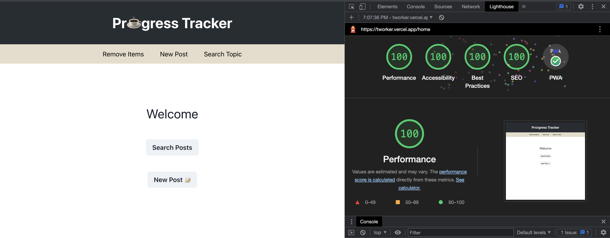

# Welcome

This repository holds the various stages of progress made towards the Work Progress Tracker Application. Each folder contains a self-sustaining stage with its own tech stack and readMe descriptions of that stage. This readMe will describe the overall journey of what started September 25th, 2022.

## Table of contents

- [Overview](#overview)
  - [Links](#links)
- [My process](#my-process)
  - [Stage 1](#stage-1)
  - [Stage 2](#stage-2)
  - [Stage 3](#stage-3)
  - [Stage 4](#stage-4)
- [Author](#author)
- [Acknowledgments](#acknowledgments)

## Overview

Having completed Hack Reactor's Advanced Software Engineering Immersive Program in May, 2022, the ritual of stand up meetings and its' ideal structure was introduced. Answer the following questions in order with concise detail. What work was done yesterday, what will you do today, and what are your blockers?

Within HR, we used excel sheets to record the teams reports, but we would often forget to record and only report on the spot. As the saying goes, "Out of sight, out of mind". It also felt uncomfortable and vulnurable to have personal work progress in a public bucket for all to see, so I would hope others would 'forget' to record entries. There is no issue that requires teams as a whole to record individual reports longterm, so what is the purpose of recording? Answer, individual profit.

I cannot remember everything that I have accomplished over the span of a month or longer. So if someone were to ask me what I have accomplished for a project or specific topic completed in the past, they would receive a generalization of lots of detailed work, which might not accurately represent the best points. I figure the solution to record individual progress and accomplishments is an easily accessible application that can be downloaded on mobile phone and or desktop.

This way, when it comes to reporting for stand ups in the work place or performance reviews, I already have responses written that will keep me on track, organized, and ready to share a more accurate and detailed version of my work.

Now I can relax more and not stress about remembering topics completed in the past and can record more personal details of work because the application data is not publically stored or shared.

## To use this application

Open the website link below and if you are using Google Chrome, the download application icon will show next to the URL, where you can download the application for use on Desktop or Android. Open the website link in Safari, open settings, and select add to homescreen to download the application on an iPhone.

## Links

- [Website](https://tworker.vercel.app/home)
- [Newest Stage Repository](https://github.com/HansenJacobA/tworker)
- [Newest Version](https://tworker.vercel.app/home)
- [Original Version](https://hansenjacoba.github.io/projects/frontend/pwa/index.html)

## My process

#### Stage 1

At the time of creation, a rock solid application to me contained a fully functional API and Frontend. With that in mind, I used what I knew best, Node.js to create an Express server, and a new database provider I never used before called LowDB to store data by writing to files (A document styled database). I created what I knew as best practice at the time, models for each table in the database to handle CRUD functionalities, all exported out an index file with the database connection. Then controllers and routes were created to combine the logic of resolving requests from the server onto the database. All of this logic was split cleanly into respective folders for each table in the database (Entries and Topics).

For the Frontend, I also used what I knew best, React and CSS, to create four different pages, Home, Create Entry, Search Entries, and View Entry. Without digging into it, thinking that every CSS library adds excess weight to an application, I decided to stick to only CSS to create all visual components. Using a folder structure that I saw on Frontend Master's, project details were split into components and pages. Webpack was used to bundle and compress the application files for production and for hot module developing. I could have created a forward proxy to connect the Frontend to the API, but soon realized that I can remove the more complex architecture of deploying an API and Frontend seperately and attempting to connect them. I started to look into storing and utilizing data from local storage instead, which lead to Stage 2 development.

#### Stage 2

Centered around local storage, 50% of the application was cut off (API). Now the application can be a single unit and self-sustaining when deployed and accessed on any device. No need to consider multiple deployments and data storage solutions like S3.

Next, I needed to find an organized way of integrating API-like logic within the React Frontend components. Just as it sounds, creating and retreiving data from local storage was implemented into the respective React components directly, which was not exactly utilizing best practices of abstraction. However, the current functionality of the application as a working unit was successful and ready for the next stage, incorporating a service worker.

#### Stage 3

The application at this point was fully operational as a standalone service online, deployed to a route branching off my GitHub portfolio page ([here](https://hansenjacoba.github.io/projects/frontend/pwa/index.html)). Now I wanted to be able to use this application at any time and anywhere, with and without internet service. I needed a service worker to serve the application files offline.

After watching the PWA course on Frontend Master's, I realized that there was a lot of work required for just a service worker. There are a few service worker services that abstract the complexities away for easier implementation, but I wanted to create my own and to eventually understand the ins and outs.

I started by creating the various images that the application would use in its' manifest details. In particular, a logo. I screenshot a black screen on my phone, drew a custom logo, then created copies of the logo in various dimensions and file types for the application manifest file to use. Then I wrote up the application manifest, setting the application description details, logo, and even the name that would be displayed when the application is downloaded into a mobile phone. After creating the manifest, the service worker must be initiated within the project itself.

Side note: Even after creating a service worker by hand like this, it did not click that all servers and things that are 'alive' are really just scripts that are run.

Using an index.html file, the service worker is invoked using a script tag in the html header (the application manifest is also referenced in the hmtl header with a link tag). Within the referenced file of the script tag, a service worker initiates a new service worker with instruction from another file. In the other file, the service worker is given assets of the application to cache and serve. Using Webpack bundling, I made sure that the service worker obtained all the bundled files to serve. With that, the service worker was ready for use and made the application usable online and offline.

Although the application was finally operational for the original purpose, the original CSS and overall user experience was pretty bad. The code itself was not as DRY as it could be, nor did it have good structure. Improving these aspects leads to the fourth and final stage.

#### Stage 4

In order to improve the structure of this application and to practice what is used in my professional work, I decided to turn this application into NextJS. Learning NextJS was thrilling as I found how easy the routing and api worked. Having already made a folder of distinct 'pages', and components, the transition to NextJS was pretty fast and easy. Next, was the change of UI.

In order to make the application uniform, I integrated Chakra UI, which has very simple to use and sleek components. I scrapped all of the old CSS files and replaced all html components with Chakra UI, and even added extra features to the application like custom messages using 'toasts'. Chakra UI made the application look more profeassional and added character IMO.

The application looked great, but there were several problems now.

After using the application daily for a month, I realized that the user experience was pretty annoying when creating new posts, because the screen would automatically zoom in on every input, and then stay zoomed in after submitting the new post. Luckily this was an easy fix that someone provided online; a simple meta tag to through into the header of the html page... but NextJS does not have an explicit html page to use, how do I add to an invisible html page? Luckily NextJS has a 'Head' component that can be added to any component to add normal header html to. I added the copied meta tag and the zooming stopped, great!

Then I realized that the application is not usable offline anymore. Even when copying and pasting the same code structure as the working React app had, the service worker repeatedly through errors that files could not be obtained. I also could not figure out if my service worker was actually running or not. I had to invoke the service worker within the NextJS app itself within the \_app file using a NextJS Script tag there pointing to the service worker. That brought the service worker to life, but it seemed that the servie worker could not get all the assets like it did in the React app. I realized that all file data is made available within the 'public' folder in a NextJS app, and so I placed all the files that the service worker might need inside of there and directed the service worker to it. This seemed to work, as the application functioned offline, but was really janky... nonetheless the application worked offline and it was now time to add a few new features.

The application as a while needed an overhaul in its structure and UX. Starting with the structure, I recreated how the application would create and read data. I abstracted all of the functionality into individual functions and placed them within a utilities folder with descriptive names. I also implemented Typescript at this time, as it is a good standard to have in all applications. Lastly, I allowed the user to view and delete individual posts, as well as delete all topics and posts, with appropriate dialogue pop-ups.

With that, the application has tranformed several times and grown into a developing teenager. There is still more work to incorporate, such as unit testing, improving the service worker (it throws errors), incorporating Husky and CircleCi, trying to Dockerize the application (Kubernetes? Idk what that is, but maybe it could be done), and integrating D3Js graphics into the application.

The point of the transformations is to learn the technology by getting the hands dirty while improving this application. I think the next phase could reasonably be turning this application into a Vite application and incorporate Vitest testing.

#### Stage 5

After phase 4, a Lighthouse Audit was done on the page and the scores were bad. The project also did not have any linters. An easy boost to this application was incorporating eslint and a11y-jsx linter, which exposed a lot of remaining required typescript. Easy and satisfying fixes to make the application 'type safe'. The Lighthouse audit required adding information into the html header component for the PWA score, allowing input field zooms to increase accessibility ratings, and fixed the service worker bug, that dropped the performance score due to console errors. In regards to the service worker, I had repetative assets, so making one asset to the public directory solved all the bugs and after completing all audit suggestions, the application now has all 100's 🎉

The next step is to create a react native version and put this in the app store and google play and see what happens. That will be phase 6 in the near future. Til then is a screenshot of the 100's!

## Author

- [Portfolio](https://hansenjacoba.github.io/)
- [LinkedIn](https://www.linkedin.com/in/jacob-andrew-hansen/)
- [GitHub](https://github.com/HansenJacobA)

## Acknowledgments

Ever grateful for Frontend Masters for teaching everything there is to know and my employer and coworkers 😭🙌
