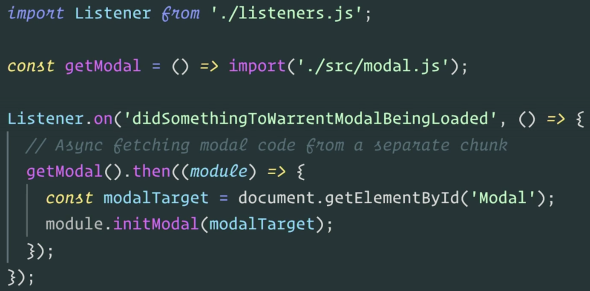

# work-progress-tracker
A daily work tracker to document progress. Can be used to maintain daily organization of work tasks and or accomplishment reflections for performance evaluations.

## Table of contents
- [Overview](#overview)
  - [Links](#links)
- [My process](#my-process)
  - [Built with](#built-with)
  - [What I learned](#what-i-learned)
  - [Continued development](#continued-development)
  - [Useful resources](#useful-resources)
- [Author](#author)
- [Acknowledgments](#acknowledgments)

## Overview
This is like Twitter, no edits allowed, just write what is current and be able to query for the data at any time.

### To use this application
- Install dependencies in both the client and api
  - cd client 
    - npm i
  - cd api
    - npm i 
- Open the application on local port 3000 in the browser and use!

### Links
- [GitHub Repository](https://github.com/HansenJacobA/work-progress-tracker)

## My process

### Built with
  #### Frontend
  - [React](https://reactjs.org/) - JS library
  - [Webpack](https://webpack.js.org/)
  #### Backend
  - [Node.js](https://nodejs.org/en/)
  - [Nano ID](https://www.npmjs.com/package/nanoid)
  - [Low DB](https://npm.io/package/lowdb)

### What I learned

#### Web Performance
- [Lazy Loading](https://frontendmasters.com/courses/webpack-fundamentals/q-a-and-closing-remarks/)
- [Code Splitting](https://frontendmasters.com/courses/performance-webpack/types-of-code-splitting/)
  - No plugin required. It's all imperative coding using dynamic import statements.
  - Lazy loading is code splitting. There is no plugin, just imperative coding with DIS.
  - Whatever is not directly visable to the user on the webpage, code split it to asynchronously load when the user scrolls, clicks, or anything to trigger later loading of content.
  - Example, code split every single route the user can go to.
  - Example of lazy loading / code splitting using DIS
  

- Tree Shaking
  - Webpack excludes unused functions in a codebase in its' bundles, creating smaller file sizes, however, cannot exclude methods in classes in OOP. So avoid many methods in OOP, use modules/functions.

- Goals for real-world application speeds for worldwide use.
  - <= 200kb (uncompressed) initial javascript [total]
  - <= 100kb (uncompressed) initial CSS [total]
  - HTTP: <= 6 initial network calls
  - HTTP/2: <= 20 initial network calls
  - 90% code coverage (only 10% code unused) 
    - Find CC values in dev tools in 'Coverage' tab. Hit reload icon.
    - This is how to obtain clients, by auditing web pages and suggesting improvements.
    - Refer to this [video](https://frontendmasters.com/courses/performance-webpack/code-coverage/) for how it's done.

### Continued development
- Add visuals showing dates that topics were marked complete in a time graph.
- Incorporate any sort of data visualization.
  - Courses to learn how to add DV 
    - [SVG Essentials & Animation, v2](https://frontendmasters.com/courses/svg-essentials-animation/)
    - [Building Custom Data Visualizations](https://frontendmasters.com/courses/d3-js-custom-charts/)
    - [Data Visualization for React Developers](https://frontendmasters.com/courses/d3-js-react/)
- Incorporate [Service Workers](https://serviceworke.rs/)

### Useful resources
  #### Backend
  - [Morgan](https://www.npmjs.com/package/morgan) - HTTP request logger middleware for node.js.
  - [Body-Parser](https://www.npmjs.com/package/body-parser) - Node.js body parsing middleware.
  - [CORS](https://www.npmjs.com/package/cors) - CORS is a node.js package for providing a Connect/Express middleware that can be used to enable CORS with various options.
  #### Frontend
  - [Webpack Bundle Analyzer](https://blog.jakoblind.no/webpack-bundle-analyzer/#how-to-configure-webpack-bundle-analyzer-cli)
  - [Webpack Compression Plugin](https://github.com/webpack-contrib/compression-webpack-plugin#minratio)
  - [Webpack Source Maps](https://webpack.js.org/configuration/devtool/) Used for debugging frontend in dev-tools via breakpoints and watch variables.
  - [Webpack Preloading](https://frontendmasters.com/courses/performance-webpack/webpack-prefetch-preload/) Consider preloading into service worker cache for fast retrieval of data at no cost. Preloading itself has a cost.
  - [Dark Patterns](https://www.deceptive.design/)
  - [Web Workers](https://frontendmasters.com/courses/service-workers/creating-a-worker/) Critical for UX and App performance.
  - [Service Workers](https://serviceworke.rs/) An upgrade from web workers b/c it persists/stays alive after closed tabs, unlike WW's.

## Author
- [Portfolio](https://hansenjacoba.github.io/)
- [LinkedIn](https://www.linkedin.com/in/jacob-andrew-hansen/)
- [GitHub](https://github.com/HansenJacobA)

## Acknowledgments
Ever grateful for Frontend Masters for teaching everything there is to know! 😭🙌